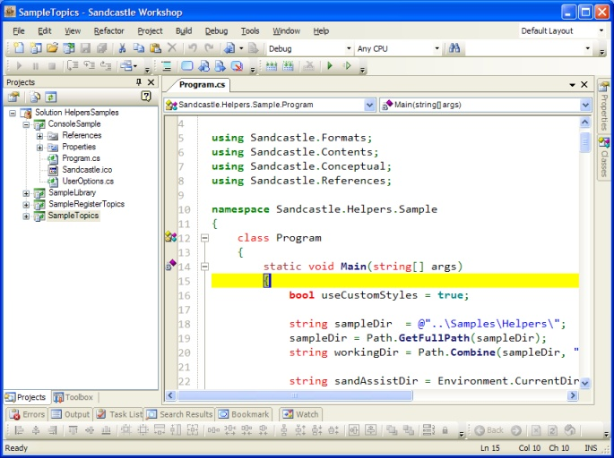
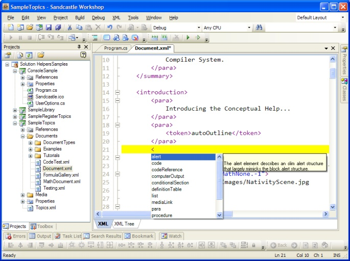

## Announcements
**April 21, 2009 - Back on Road**
We have completely recovered all the files, and currently preparing to move the local sources to a new PC. Meanwhile, we have slowly started the coding again!

**March 17, 2009 - Bad News**
The hard disk containing the local repository for the source codes of the Sandcastle Assist project is down. We are doing everything to recover the latest version of the codes from the bad disk, there will be a delay in the schedule but we will get there! With the exception of the Sandcastle Workshop, most of the sources uploaded to the Codeplex are nearly up to date.

**February 18, 2009 - Sandcastle Workshop Updates**
The source codes of the Sandcastle Workshop environment is now updated to reflect the released version of the SharpDevelop 3.0.

**February 5, 2009 - Now Available: Sandcastle Workshop - Planning**
The previously announced planning stage of the Sandcastle Workshop is now available, you can [download](http://www.codeplex.com/SandAssist/Release/ProjectReleases.aspx?ReleaseId=22713) the sources and/or the binary at the **Planned** section of the **Releases** page. The reported bug is still pending!

**January 31, 2009 - Sandcastle Workshop - Planning**
The **planning** stage of the [Sandcastle Workshop](Sandcastle-Workshop) is almost complete and will be available on Monday/Tuesday - there is a bug we wish to fix. This is just the planning stage, not even alpha and Sandcastle build tools are not yet integrated. Here are some screenshots of the environment, built on a customized **lite** version of [SharpDevelop](http://www.codeplex.com/SharpDevelop), you can call it SharpDevelop Shell.

**January 20, 2009 - Sandcastle Custom Build Components**
With the [Sandcastle Helpers](Sandcastle-Helpers) as the build testing library, we are now restarting the work on the [Sandcastle Build Components](Sandcastle-Build-Components). We will develop it to at least a beta stage to make it ready for the final round of Sandcastle Helpers developments.

**December 4, 2008 - Sandcastle Helper Preview**
The preview of the Sandcastle Helpers will be released this weekend. We have sorted the problems and improved it. Also, we wish to announce that the Helpers library will become the Builders library. Please see the discussion forum for details.

**November 15, 2008 - Sandcastle Helper Preview - Delayed**
There is a delay in the promised release of the Sandcastle Helper preview. We have found faulty design/implementation that will limit the features of the library and currently working to rectify it. We are sorry for any inconvenience.

**October 08, 2008 - Changes and Developments**
* **Help 2.0 Registration Tools and Utilities**: We are happy to announce that we have the permission to distribute the Help 2.0 Registration tools and utilities written by [Mathias Simmack](http://www.simmack.de/tutorials/das-help-20-format/). These tools are free and are redistributable. We have completed the translation of the Help2Register documentation to English, and currently testing and preparing for release. We want to express our sincere gratitude to Mathias for giving the Sandcastle community this great tool.
* **Sandcastle Helpers**: We have completed the design and coding of major parts,  and currently preparing to release a CTP (next week) before the first beta version.

**July 25, 2008 - Changes and Developments**
* **MimeTeX**: We are stopping the support of the [MimeTeX](http://www.forkosh.com/mimetex.html) in the [Math Component](Math-Component) due to licensing issues. To improve the input and output of the MimeTeX will require a lot of work, and the current license does not make it worth the effort. We will continue to improve the support of MikTeX, especially the speed in the math component.
* **SBAppLocale**: We have the permission to redistribute the [SBAppLocale](http://www.steelbytes.com/?mid=45), which will be used in DBCS fixing for the CHM output. We will integrate this into the [Sandcastle Builders](Sandcastle-Builders) tasks. We will also provide support for the [Microsoft AppLocale Utility](http://www.microsoft.com/globaldev/tools/apploc.mspx), where it is installed.