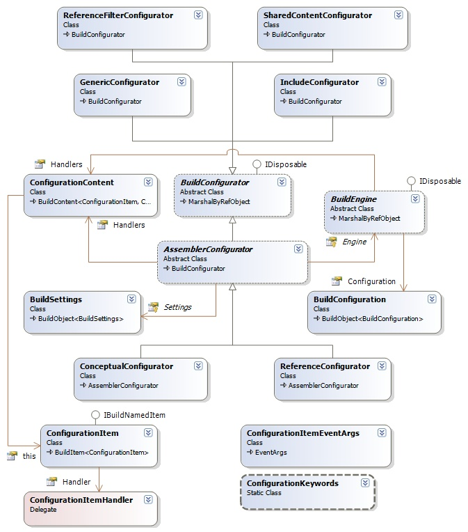

## Sandcastle Helpers: Build Configurators
The build configurations are used to edit or modify the various configuration files required by the Sandcastle build process.

### Build Configurators Design
The class diagram for the build configuration handler and related classes is shown below:

**Under Construction**.