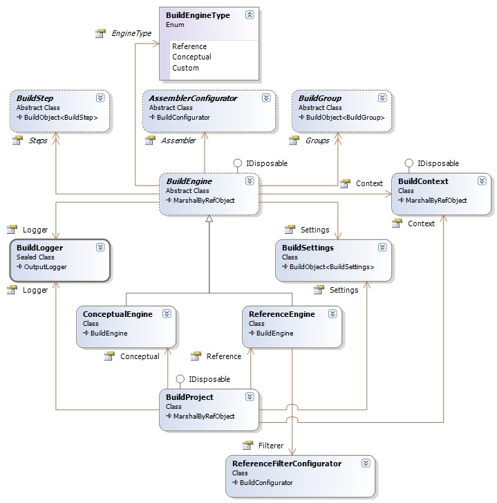

## Sandcastle Helpers: Build Engines
The build engines are the controlling center for all the various steps and operations required in a build process. 

### Build Engines Design
The class diagram for the build engine and related classes is shown below:

**Under Construction**.