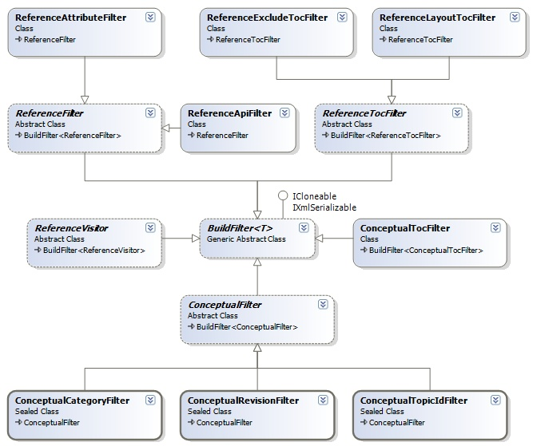

## Sandcastle Helpers: Build Filters
The build filters are used to define various filtering operations on the help contents.

### Build Filters Design
The class diagram for the build filters and related classes is shown below:

**Under Construction**.