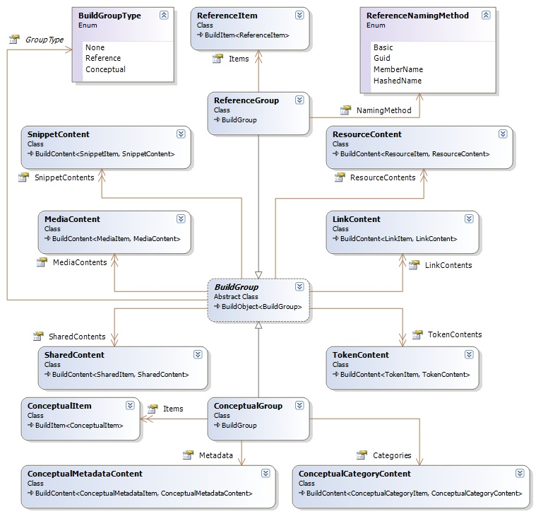

## Sandcastle Helpers: Build Groups
The build groups define the actual help collection groups; conceptual and reference, and host the contents and custom configuration or customization information required by each collection.

### Build Groups Design
The class diagram for the build groups and related classes is shown below:

**Under Construction**.