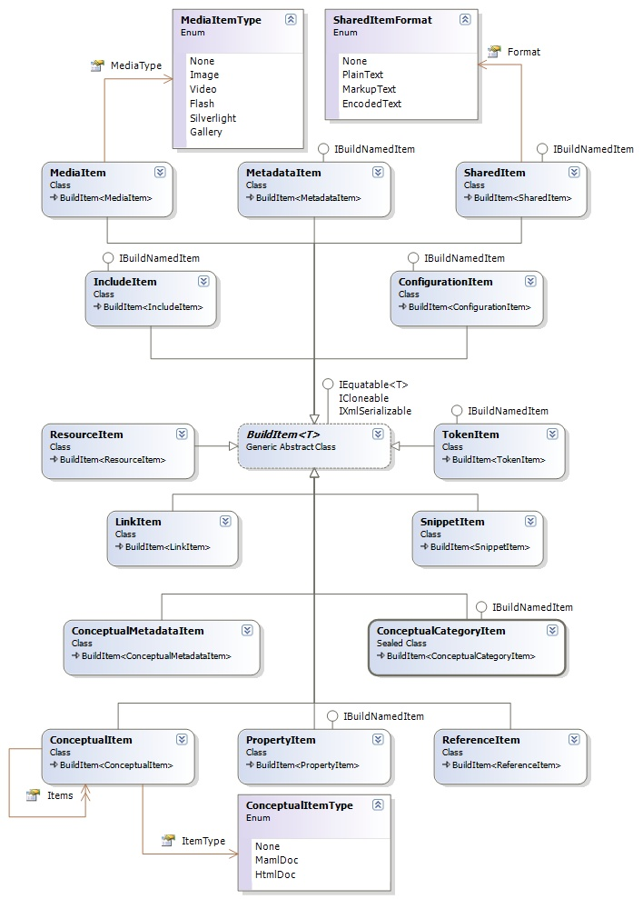

## Sandcastle Helpers: Build Items
The build items define the various basic build units, such as the reference comment/assembly file, the conceptual topic file etc used by the build process.

### Build Items Design
The class diagram for the build items and related classes is shown below:

**Under Construction**.