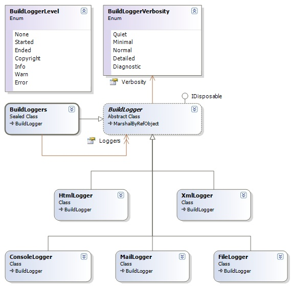

## Sandcastle Helpers: Build Loggers
The build output logger is  used to monitor the progress of a Sandcastle build process. 

### Build Logger Design
The class diagram for the various build logger classes is shown below:

This is designed to follow the [Adapter Pattern](http://en.wikipedia.org/wiki/Adapter_pattern), with **BuildLoggers** as the Adaptor and the various implementations as the Adaptees.

**Under Construction**.