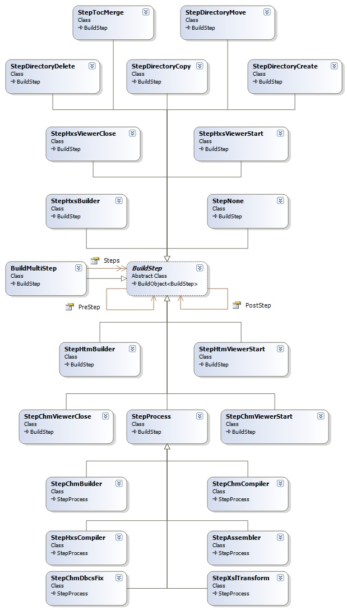

## Sandcastle Helpers: Build Steps
The build steps define the various commands that must be executed in order to build, view, clean up, and register or deploy a help file using the Sandcastle build system.

### Build Steps Design
The class diagram for the various build step classes is shown below:

**Under Construction**.