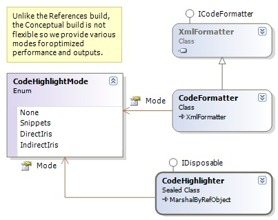
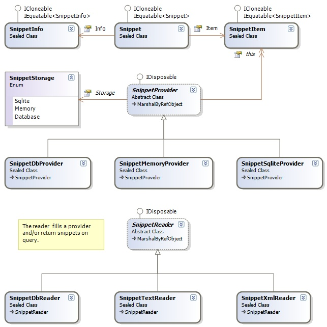
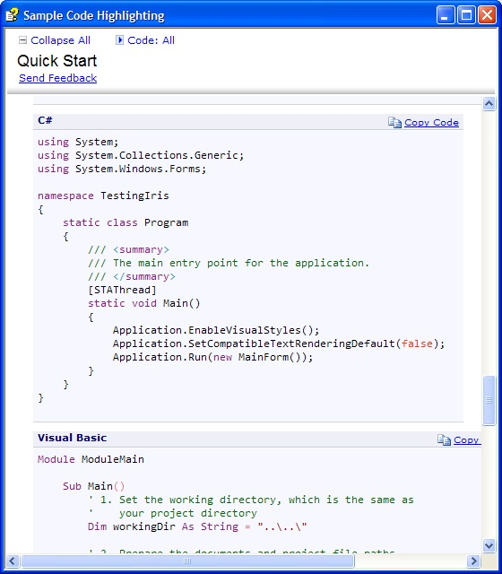

### Code Syntax Highlighting Component
Here you will find information on the Code Syntax Highlighting Component, which is part of the Sandcastle Assist custom build components for the [Microsoft Sandcastle](http://msdn.microsoft.com/en-us/vstudio/bb608422.aspx), a documentation compiler for managed class libraries.

**Application**: Reference and Conceptual Documents

#### Introduction
This code component allows you to enable full syntax coloring in your references and conceptual documents. It is built using the [Iris Syntax Highlighter](http://duartes.org/iris/), which is an open source syntax highlighting class libraries using the [Vim](http://www.vim.org) syntax files to provide coloring of over 460 languages.

**Motivation**
* Being one of the early Sandcastle's conceptual help users, we were faced with how to color our sample codes. There was no custom build component that supported the syntax coloring in the conceptual help environment, so we decided to search for a suitable solutions - God bless the Iris team, we found it!
* Even now no custom build component provides a complete solution for both the **<code/>** and **<codeReference/>** conceptual MAML tags, so we expanded the scope to satisfy the needs of all users.

**Code Formats**
* **Internal Code Snippets**: We provide the support for the embedded code snippets created with the **<code/>** tag.
* **External Code Snippets**: We provide the support for the external file code snippet sources with the **<codeReference/>** tag. We are providing the support for the current Sandcastle Code Snippets format (an XML format), support for text source files, and support for database code snippets. This is discussed further below.

The implementation of syntax highlighting in the conceptual documentation is a little challenge, since the XSL transformation component, unlike the references, does not allow any HTML tag generated by components before it to pass through to the output.
Our initial implementations, which uses the features custom tags used by the Sandcastle's own **ExampleComponent**, was broken by the May 2008 release of the Sandcastle. Our current implementations even work better!

**Note**: The ExampleComponent is broken in the May 2008 release, fixes are available in the [Sandcastle Styles](http://www.codeplex.com/SandcastleStyles). The fix or update is, however, not required to run this component.

The following diagram shows the classes that provide the bridge between the Iris Syntax Highlighter and the code component.

In the implementation of the external code snippets, we provide an extensible framework, which allows us to support various formats of the code snippets definitions or identifiers, and also provide support for both accessing various formats and storing the results in customizable storage. 
For the default Sandcastle code snippets format, you can store the read snippets in memory (as in the case of the ExampleComponent) or in an embedded SQLite database. Here is the class diagram:

#### Requirements and Installations
Only the Sandcastle May 2008 Release, no special requirements or installation is required. The Sandcastle Assist package comes with all the needed libraries, styles and scripts files. No part of this implementation is dependent on the Sandcastle Styles update.

#### Features
**Under Construction** Provide the features

#### Configurations and Options
**Under Construction** Provide the configurations and options

#### Outputs  (Screenshots)
Here are some results from the code highlighting custom build component

