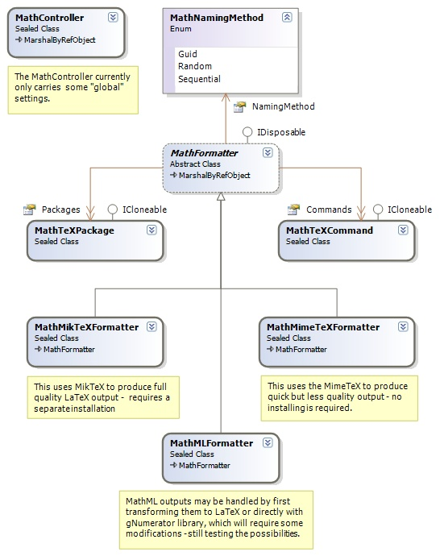
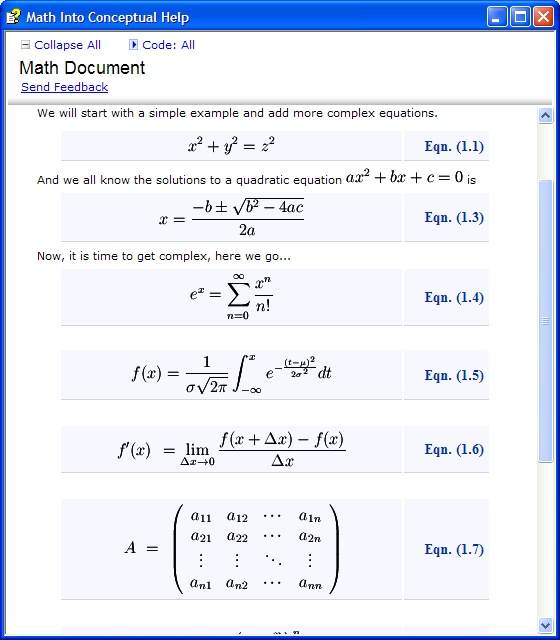

### Math Component
Here you will find information on the Math Component, which is part of the Sandcastle Assist custom build components for the [Microsoft Sandcastle](http://msdn.microsoft.com/en-us/vstudio/bb608422.aspx), a documentation compiler for managed class libraries.

**Application**: Reference and Conceptual Documents

#### Introduction
The component allows you to type mathematical formula and equations into both reference and conceptual documents
and have this transformed into an image and inserted into the final output.

**Motivation**
* While working on a company product's documentation recently, we needed math equations embedded into the documents, and bought a commercial tool for this. The quality of the output was not very impressive, and the whole process was time consuming.
* The conceptual help [MAML](http://en.wikipedia.org/wiki/MAML) supports a tag **<math/>**, which by the documentation is used for math equations so all that was needed was the tool to transform that into images. With a background in TeX/LaTeX, we started looking for a LaTeX-based solution and found it easy. This is what we are sharing with the Sandcastle community.

**Math Formats**
* [LaTeX](http://en.wikipedia.org/wiki/LaTeX), the undisputed leader in math equations, is fully supported,
* [MathML](http://en.wikipedia.org/wiki/MathML), the support is planned but not currently available.

**Note**: If you are not comfortable with LaTeX format, you can use the free WYSIWYG Tool, [TeXaide](http://www.dessci.com/en/products/texaide/) or the commercial version MathType by the same company. Both produce a LaTeX output you insert into your document, you can be assured that the output will have a better quality that the MathType output.

The implementation is flexible, and could be easily extended to support any format. The conversion is done in _MathFormatter_ class shown in the diagram below:

 

#### Requirements and Installations
* **MathML**: This is currently not implemented and there is no requirement yet.
* **LaTeX**: The requirements and installations depends your choice of rendering engine:
	* [Using MimeTeX](http://www.forkosh.com/mimetex.html): This is a simple TeX implementation, which parses a LaTeX math expression and immediately emits the corresponding gif image, rather than the usual TeX dvi.
		* It requires no installation or configurations, and it comes with the Sandcastle Assist package.
		* It is very small (548 KB) and fast
		* The quality of the output is poor, but not be good for most documentation requirements.
	* [Using MikTeX](http://miktex.org/Default.aspx): This is the most is an up-to-date TeX implementation for the Windows operating system, and produces full dvi.
		* It requires installation and configuration, but the math component is fully functional with the _Basic_ installation.
		* It is big 77.79 MB, and may be slower.
		* The quality is very high and offers many customizations.

**Note**: If you have the disk space for the 77.79 MB, we recommend you install the MikTeX for a full LaTeX experience.

#### Features
The following features are currently support by the math build component
* In-line mathematical equations.
* Displayed mathematical equations.
* Use of two different rendering engines depending on user's quality requirement and machine specifications.
* Automatic equation numbering, with customization of format and style.
* Customization of the math environment styles.
* No change to the current limited environment defined by the conceptual **<math/>** tag.
* Easy and highly flexible.

As stated above, we did not change the current <math/> tag or added new attributes, since that will break the current MAML schema.
We, however, took the advantage of lack of the <math/> tag in the references documents to introduce more flexible extensions.

**Note**: The default output follows the specification defined in the [Technical Publishing with Word](http://research.microsoft.com/users/jckrumm/Word%20Tips/technical%20publishing.htm) paper.

#### Configurations and Options
**TODO: Under Construction** Provide the configurations and options

#### Outputs (Screenshots)
Here are some screenshots of the output from the math custom build component in a conceptual documentation. It demonstrates the following
# The quality output of the MikTeX.
# The use of 12pts font size instead of the default 10pts.
# The in-line and displayed equations.
# Use of custom equation number format, which includes "_Eqn._" text and page number.

