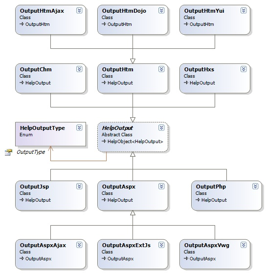

## Sandcastle Common: Outputs 
The output system or framework will enhance the current HTML-based presentations of the Sandcastle for easy navigation, viewing and searching for integration into Windows and Web applications.
It will provide various outputs or viewing packages for the Sandcastle help, including of course the default HtmlHelp 1.x and 2.x. Also, use in the [Adobe Flash](http://en.wikipedia.org/wiki/Adobe_Flash), [Adobe AIR](http://en.wikipedia.org/wiki/Adobe_Integrated_Runtime) and [Microsoft Silverlight](http://en.wikipedia.org/wiki/Silverlight) is being considered. Also, [JQuery UI](http://ui.jquery.com/) is making a great progress, and we will track it.

**NOTE**: These are not different presentations, but enhancements for viewing and navigation of the current Sandcastle HTML-based outputs. Other presentations such as Microsoft Word format, Rich Text Format, PDF etc., will be considered for the [Sandcastle Styles Project](http://www.codeplex.com/SandcastleStyles).

### Design Consideration
* Each output type will present properties for configuration customization by the user, or may support a specialized configuration format.
* Each output will create a **HelpCommand** implementation that can be used by the **Build Task** to perform the operations specific to the output.
* Each output's properties will be edited or modified with a control in the [Sandcastle Controls](Sandcastle-Controls) package.

### Output Information
#### 1. OutputChm: The Compiled HtmlHelp 1.x Output
* **Description**: The compiled HtmlHelp 1.x (or the **.chm** file) output is already supported by the Sandcastle.
* **Application**: Windows standalone applications
* **Planned For Version**: 1.0.0.0

#### 2. OutputHxs: The Compiled HtmlHelp 2.x Output
* **Description**: The compiled HtmlHelp 2.x (or the **.hxs** file) output is already supported by the Sandcastle. It is the help format used by the MSDN help collection.
* **Application**: Windows standalone applications
* **Planned For Version**: 1.0.0.0

#### 3. OutputHtm: The Generic Html Output
* **Description**: The Sandcastle basically produce HTML. This output will use simple means to present it, including a navigation pane for accessing the topics. It will use CSS and Javascript, but will not depend any external library or framework.
* **Application**: Windows standalone and Web applications, similar to Javadoc.
* **Planned For Version**: 1.0.0.0

#### 4. OutputHtmAjax: The Ajax based Html Output
* **Description**: This will use extensive Ajax to enhance the nagivation of the HTML produced by the Sandcastle. Currently, the [Microsoft Ajax library](http://www.asp.net/ajax/downloads/) is being considered for this presentation.
* **Application**: Windows standalone and Web applications, similar to Javadoc.
* **Planned For Version**: 1.5.0.0

#### 5. OutputHtmDojo: The Dojo based Html Output
* **Description**: This presentation will use the [Dojo Toolkit](http://dojotoolkit.org/) to enhanced the navigation of the Sandcastle output. The Dojo library offers several options, including extensive graphics support in its DojoX library.
* **Application**: Windows standalone and Web applications, similar to Javadoc.
* **Planned For Version**: 1.5.0.0 or later

#### 6. OutputHtmYui: The Yahoo (YUI) based Html Output
* **Description**: This presentation will use the [Yahoo User Interface Library](http://developer.yahoo.com/yui/), which supports treeview, panes and layout. etc., to enhance the navigation of the Sandcastle output.
* **Application**: Windows standalone and Web applications, similar to Javadoc.
* **Planned For Version**: 1.5.0.0

#### 7. OutputAspx: The Generic ASP.NET Output
* **Description**: This will enhance the default Sandcastle web output, which is a master page ASP.NET web site, but will **not** use any ASP.NET AJAX feature or external library.
* **Application**: Server side Web applications.
* **Planned For Version**: 1.0.0.0

#### 8. OutputAspxAjax: The ASP.NET AJAX based Output
* **Description**: This will use the [ASP.NET AJAX](http://www.asp.net/ajax/) framework to provide a web help, it will work with both the .NET 2.x and the .NET 3.5.
* **Application0**:  Server side Web applications.
* **Planned For Version**: 1.0.0.0

#### 9. OutputAspxVwg: The Visual WebGui based Output
* **Description**: This will use the [Visual WebGui library](http://www.codeplex.com/visualwebgui) to provide web help.
* **Application**: Server side Web applications.
* **Planned For Version**: 2.0.0.0

#### 10. OutputAspxExtJs: The ExtJS based Output
* **Description**: This will use the [ExtJS library](http://extjs.com/) to provide a web help.
* **Application**: Server side Web applications.
* **Planned For Version**: 2.0.0.0 or later.
**NOTE**: This output may be replaced with another library with a more flexible license or simply dropped.

#### 11. OutputJsp: The Java JSP based Output
* **Description**: This will use the Java-based [JSP Framework](http://java.sun.com/products/jsp/) to provide web help.
* **Application**: Server side Web applications.
* **Planned For Version**: 2.0.0.0 or later

#### 12. OutputPhp: The PHP based Output
* **Description**: This will use the [PHP Framework](http://www.php.net/) to provide web help.
* **Application**: Server side Web applications.
* **Planned For Version**: 2.0.0.0 or later