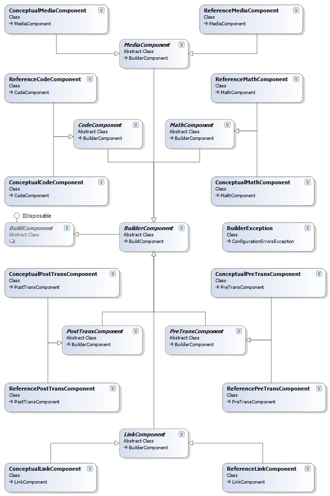

## Sandcastle Build Components 
A number of custom build components, which enhance and improve the documentation build system.

#### Class Diagram
For the build components, we introduced the **BuilderComponent** class, which will serve as the abstract base class
for all our custom build components.

The current plan is to implement the classes shown in the diagram below, more are planned and will be
announced soon. We separate the references components from the conceptual components to allow each
to take maximum advantage of each system, providing the system specific extensions where possible.

The available components are

* **[Pre-Transform Component](Pre-Transform-Component)**
* **[Code Syntax Highlight Component](Code-Syntax-Highlight-Component)**
* **[Math Component](Math-Component)**
* **[Link Component](Link-Component)**
* **[Media Component](Media-Component)**
* **[Post-Transform Component](Post-Transform-Component)**

