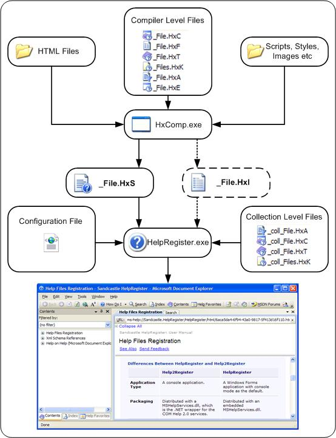
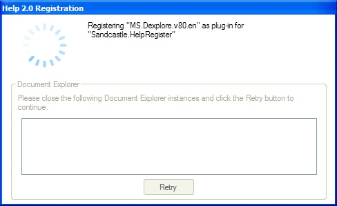
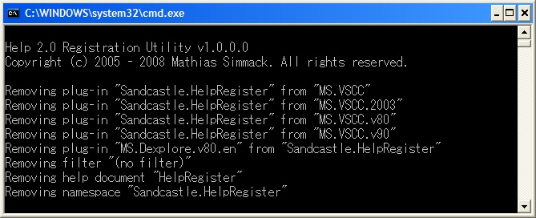

## Sandcastle HelpRegister Application
A ready-to-use .NET application for registering Help 2.0 collection files. 

The Microsoft Help 2.0 files must be registered on the target computer before it can be viewed. Basically, this registration is providing your help file with a globally unique name, called the namespace, by which it can be referenced. Any other help file can reference your help file by its namespace without knowing the exactly location of your help file on disk.

# **Registering Using Merge Modules**: Microsoft provides a means of registering help file using the Windows Installer, and provides a number of merge modules for this method.
# **Registering Using HelpRegister**: For a .NET developer, this is the easiest and the most convenient way to test and deploy your help files. 
The following diagram summarizes the process of compiling and registering Help 2.0 files using the HelpRegister tool. 

The HelpRegister is a Windows Forms application, with a simple interface shown below:

It, however, runs in the console mode by default:
