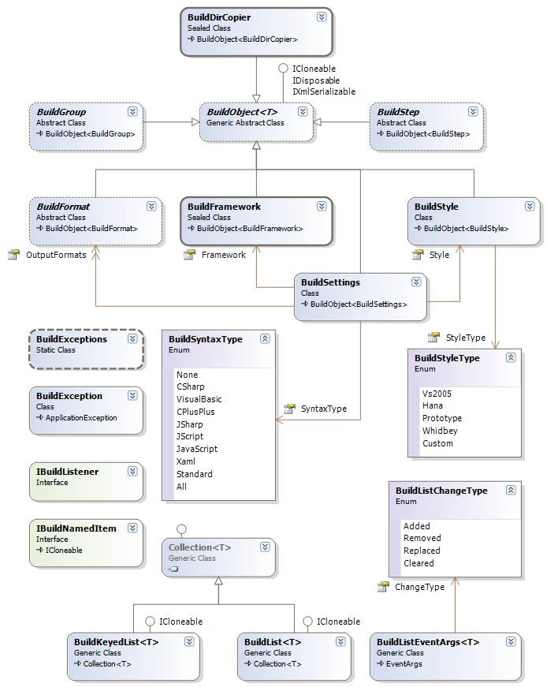

## Sandcastle Helpers - Lite Builders
This is a simple but complete Sandcastle help builder library. 

### Why Lite Builders?
We needed a flexible build environment or script to test the various components we are working on. After a long thought, I decided to bring the current help builder library I use at my workplace (lets call it, **workplace builder**) to handle it.
However, the **workplace builder** library has several limitations. In particular,
* It builds only the Vs2005 style, the Hana and Prototype styles are not supported
* It builds only the compiled HtmlHelp (*.chm) file.
* It does not modify the configuration files, apply filters etc, these are modified manually.
An attempt to improve the **workplace builder** results in this complete reusable help builder library. We have, therefore, decided to make it available to anyone requiring a similar library - it does **not** depend on any other Sandcastle Assist package. Also, the build process used here is different from the tasks in the main [Sandcastle Builders](Sandcastle-Builders) library, so this library could be considered as an alternative help builder library.  

### Lite Builders Features
The following are some of the features of the Sandcastle Helpers library
* Complete and fully featured help building library, which builds both conceptual and references.
* Easy to understand object-oriented design, with high flexibility to extensions and customizations.
* Builds all the available help styles; Vs2005, Hana, Prototype and Whidbey.
* Builds Help 1.x, Help 2.x and web helps.
* Provides easy customization framework for handling all the Sandcastle configuration files.
* Not designed for any particular project type, so any project type can be directly used without import. It basically does not require a project file.
* Not designed for any particular GUI, and can be used in any environment or IDE.
* It works with Sandcastle transforms and styles in any directory, so you can keep the main distributions, the Sandcastle Styles, and your own styles and use any.
* It automatically handles the Whidbey style, which Microsoft is actually maintaining even though it is not directly exposed.
* etc...

### Lite Builders Designs
The design of this project is almost complete. There may be minor changes, most likely improvements.
Like other Sandcastle Assist project, this Sandcastle Helpers is on object-oriented framework, designed to make it easy to understand and extend.

The core of this design is represented by the diagram below, most objects are designed to be cloneable and serializable. The base object here is the **BuildObject** abstract class.

Here is a brief description of the classes, interfaces, structures and enumerations in the above diagram:
* **BuildObject**: As stated earlier, this is the base class for most Sandcastle Helpers objects, and it defines the basic cloneable and serialization interfaces.
* **BuildFramework**: This defines the platform or version of the .NET framework, which is the target of a build output.
* **BuildStyle**: This defines the styling (Vs2005, Whidbey, Prototype, Hana), as indicated by the **BuildStyleType**, for a build output.
* **BuildSettings**: This defines all the settings including the build syntax and filter languages (as indicated by the **BuildSyntaxType**),  the build output directory, the build file name etc., for a build output.
* **BuildException**: Build process specify exception class.
* **BuildDirCopier**: A utility class for copying directories.
* **BuildExceptions**: A utility class for throwing common exceptions, such as the ArgumentNullException.
* **BuildFormat**, **BuildGroup**, **BuildStep** are abstract base classes. These will be discussed under their own sections.
The design can be divided into several parts, and links to pages providing class diagrams are given below:
* **[Build Loggers](Build-Loggers)** A logging system for the outputs.
* **[Build Formats](Build-Formats)** An abstraction of the various help formats supports, Help 1.x, Help 2.x etc.
* **[Build Configurators](Build-Configurators)** A configuration framework for the various Sandcastle configuration files.
* **[Build Filters](Build-Filters)** A filtering framework for the outputs.
* **[Build Items](Build-Items)** An abstraction for all the various items required in a build process.
* **[Build Contents](Build-Contents)** An abstraction of all the contents of required in a build process. These are containers for **Build Items**.   
* **[Build Groups](Build-Groups)** An abstraction defining the grouping of the help collection types; conceptual and reference (for now) handled by the Sandcastle. These are containers for the various **Build Contents**.
* **[Build Steps](Build-Steps)** An abstraction of the steps required to build a help file.
* **[Build Engines](Build-Engines)** The controlling center of all the builds, configuration, settings etc.

### Lite Builders Sample
We will present an illustration of how to use the Lite Builders to create a simple console application for building conceptual and reference helps.

**Under Construction** Still :)