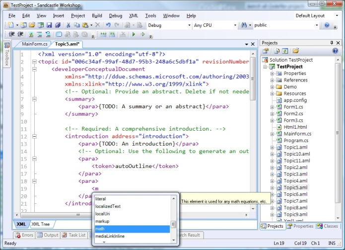

## Sandcastle Workshop
This is a complete Integrated Developer Environment (IDE) for creating and compiling help systems using the [Sandcastle](http://sandcastle.codeplex.com/) compiler. 
It will fully utilize our Sandcastle builder libraries, custom build components and related tools to provide a complete access to the Sandcastle compiler. This will be the Sandcastle equivalent of the HtmlHelp Workshop, and will provide support for both reference and conceptual help.

Sandcastle Workshop is based on [SharpDevelop](http://sharpdevelop.codeplex.com/), a scaled-down version of that IDE with improved usability.

----
**NOTE**: The changes or modifications we made to the SharpDevelop includes 
* Replacing all the XML-based Windows Forms, which is a format originally supported by the early SharpDevelop Form Designer.
* Reworking the toolbar service to support multiple tools.
* etc
These changes break many existing SharpDevelop Add-Ins, and many cannot be directly used in the Sandcastle Workshop.
----

### Features
Many, many...to be continued!

### Developments
The Sandcastle Workshop started with the beta release of the SharpDevelop 3.0, and is now updated to match the SharpDevelop 3.1 release.
SharpDevelop (and therefore Sandcastle Workshop) is an Add-In based system, and all parts with the exception of the core, the base and other libraries are all Add-Ins.
Sandcastle Workshop is a Windows Forms application, developed mainly in C# language using the VS.NET 2008. Some components or Add-Ins require .NET 2.x and others .NET 3.5.

Our modified and enhanced code base can also be used for other projects. The Sandcastle Workshop itself (or the Sandcastle specific parts) will be created as Add-In projects/components and in a separate solution folder. 
We are planning four projects/components in this Add-In category:
* **Sandcastle.Workshop:** This project/assembly will define the Sandcastle specific base or common part for the IDE, and among other things, it will contain
	* MAML/AML/CMP Display-Bindings, for editing conceptual help topics
	* Sandcastle Conceptual Topic Templates
	* Sandcastle Custom Component Templates
	* TextLib Extensions (Clip Texts) for Conceptual Tags support
* **Sandcastle.Workshop.Tools:** This project/assembly will provide access and integrate various Sandcastle and related tools, including
	* Help 2.x Management and Registration Tools
	* Sandcastle Reflection Database Management
	* Import, Export and Conversion Tools
	* etc
* **Sandcastle.Workshop.Builders:** This project/assembly will be the Backend-Binding, in SharpDevelop terms, providing the management and compilation of the Sandcastle help in the IDE.
	* Contents Editors
		* Media/Image Content Editor
		* Tokens Content Editor
		* Bibliography Content Editor
		* Snippets Content Editor
		* Mathematical Formula and Equations Content Editor'
		* Samples Content Editor
		* Shared Content Editor
		* etc
	* Configurations and Settings
		* Groups (Conceptual, Reference etc)
		* Project Creation and Managements,
		* Output and Format Configurations
		* etc
	* Building
		* Compilation and Viewing
		* Deployments
* **Sandcastle.Workshop.Resources:** The project will create and manage the various resource files for localization of the Sandcastle Workshop components.

### Editions
The first release will be available in only one edition (with setups for 32-bit and 64-bit Windows). Depending on how the Sandcastle Workshop is accepted and used by the community, we may create at least two editions; Standard and Professional. There may also be an Express Edition, if users still want a version smaller than the Standard Edition.
* **Standard Edition**
	* Basically, the current feature set, and 
	* At most three most desired utilities or tools Add-In.
* **Professional Edition**
	* All the features of the Standard Edition,
	* WiX based setup Add-In
	* Source Control (Subversion, in particular) Add-In
	* More Display/Backend-Bindings
	* etc